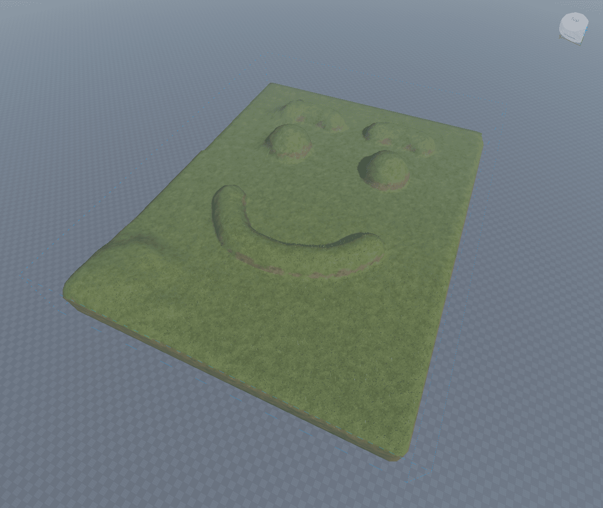
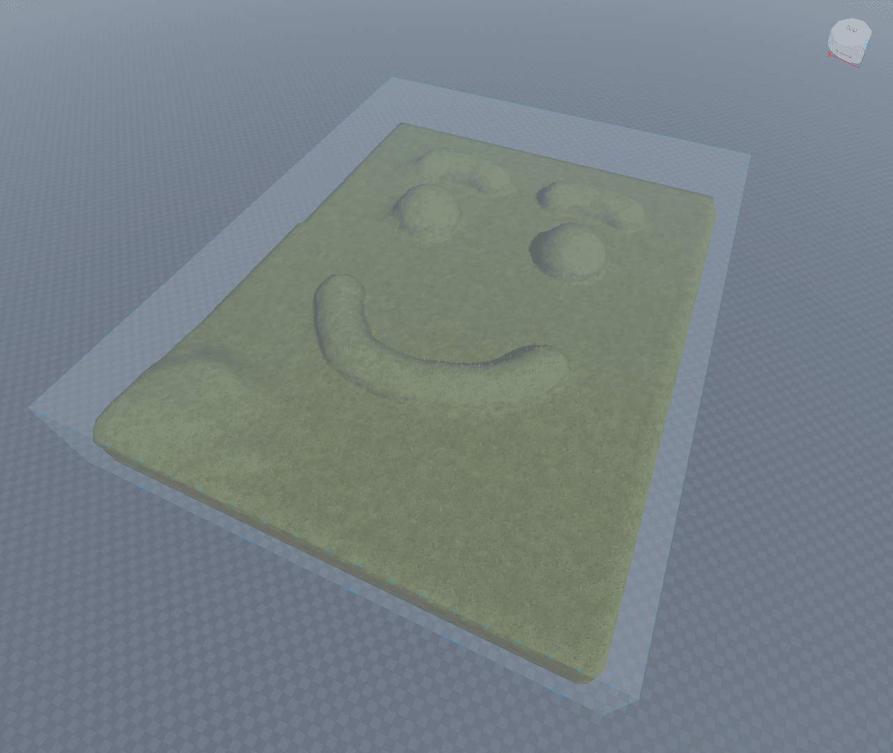
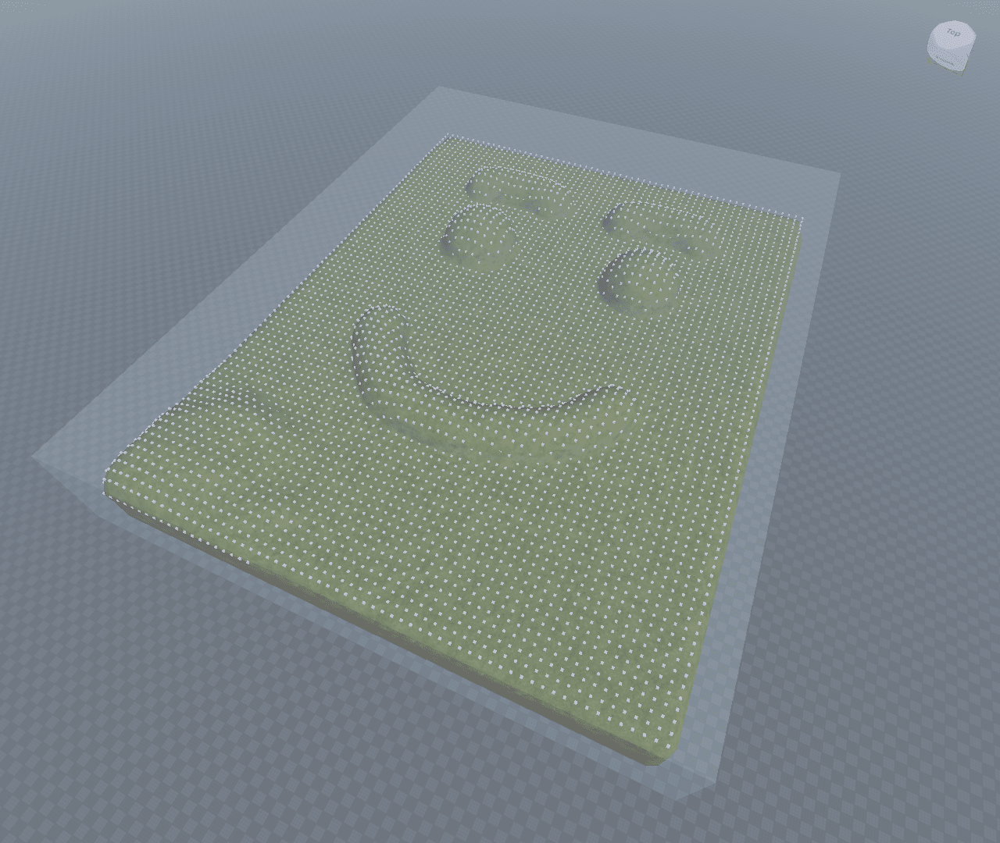
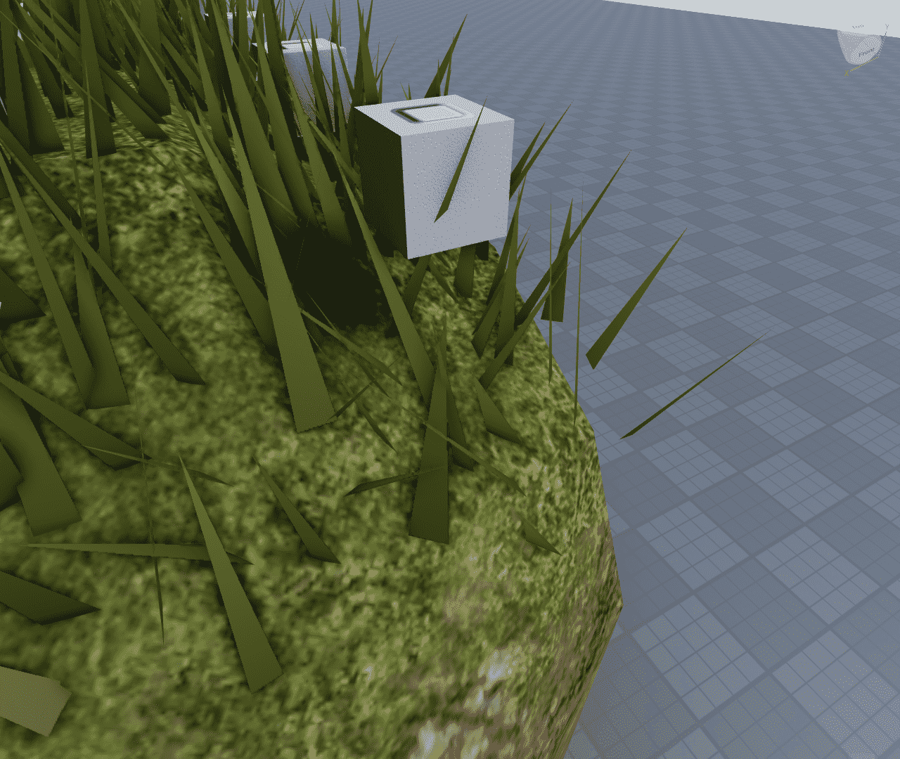

# Approximate Top of Terrain

> Made for personal use, if you have a use for it, feel free to use it for what the repository [license]() permits.

This module gets the approximate top of the terrain in a Region3 area.

## API

```lua
atot.part2Region(part) -> Region3
-- part(Part): a part object to get the region3 from
```

```lua
atot.atot(terrain, region, resolution) -> Table
-- terrain(Terrain): the terrain object to get the surface of (eg. workspace.Terrain)
-- region(Region3): the region3 to get the surface values in
-- resolution(int): only set to 4, Roblox's Terrain:ReadVoxels takes a resolution param incase they add different size voxels in the future

--> returns(Table): a 2dim table for the x and z voxel coordinates
```

## Quick Use



create a part over your terrain to easily get a Region3 with atot.part2Region

```lua
local region = atot.part2Region(workspace.regionPart)
```



get the positions of the top of each voxel with atot.atot, then for demo, put a 1x1x1 part on each position.

```lua
local positions = atot.atot(workspace.Terrain, region, 4)

for x = 1, #positions, 1 do
    -- NOTE: positions[x] can be nil, and so #(positions[x] or {}) is
    -- to prevent a error of attempting to index a nil
	for z = 1, #(positions[x] or {}), 1 do
		local pos = positions[x][z]

		if pos then
			local part = Instance.new("Part")
			part.Position = pos
			part.Size = Vector3.new(1, 1, 1)
			part.Anchored = true
			part.Parent = workspace
		end
	end
end
```



## Notes

1. The name is "Approximate Top of Terrain" because it is not always exact 

2.
